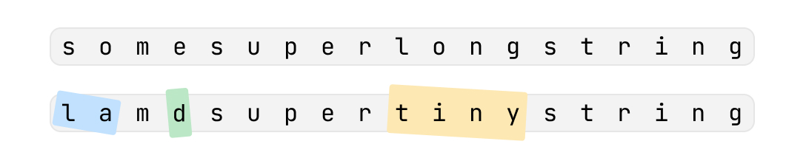
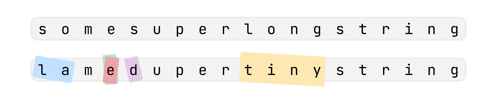

### Условие задачи

Для отслеживания посылок компания NOZO использует наклейки с надписями. Иногда надпись (или её часть) на наклейке нужно исправить, и тогда поверх старой наклейки лепят новую.

На очередной посылке появилось слишком много наклеек и теперь невозможно прочитать наклеенную надпись целиком.

Помогите это сделать по истории этих наклеек.

### Входные данные
Первая строка s представляет собой содержимое изначальной наклейки. Гарантируется, что её длина не превышает 1000 символов.

Во второй строке записано целое число n (1≤n≤1000), обозначающее количество наклеенных поверх наклеек.

Далее идёт n строк, каждая из которых описывает очередную наклейку в порядке её применения: от самой старой к самой новой. Каждое описание содержит два числа starti​ и endi​ ((1≤start≤end≤∣s∣, где ∣s∣ обозначает длину строки s) и через пробел строку ri​, которая была записана поверх символов между starti​ и endi​. Гарантируется, что длина строки ri​ точно равна end−start+1. Эта запись обозначает, что поверх всех символов, начиная с символа под номером start и заканчивая символом под номером end, была наклеена строка ri​.

Гарантируется, что все строки состоят только из строчных латинских букв.

### Выходные данные

Выведите итоговую строку, которая видна после применения всех наклеек. Иллюстрация к первому примеру из условия:



Пояснение к первому примеру:
∙
∙ Наклеивается первая наклейка и строка становится lamesuperlongstring.
∙
∙ Наклеивается вторая наклейка и строка становится lamdsuperlongstring.
∙
∙ Наклеивается третья наклейка и строка становится lamdsupertinystring.

Иллюстрация ко второму примеру из условия:



Пояснение ко второму примеру:
∙
∙ Наклеивается первая наклейка и строка становится lamesuperlongstring.
∙
∙ Наклеивается вторая наклейка и строка становится lamdsuperlongstring.
∙
∙ Наклеивается третья наклейка и строка становится lamdsupertinystring.
∙
∙ Наклеивается четвертая наклейка и строка становится lamedupertinystring.

### Пример теста 1

#### Входные данные

```
somesuperlongstring
3
1 2 la
4 4 d
10 13 tiny
```

#### Выходные данные

```
lamdsupertinystring
```

### Пример теста 2

#### Входные данные

```
somesuperlongstring
4
1 2 la
4 4 d
10 13 tiny
4 5 ed
```

#### Выходные данные

```
lamedupertinystring
```
